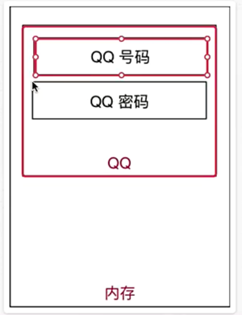

3.3 新建项目 1)命名规则

-   以后 项目名 前面都以 数字编号，随着知识点递增，编号递增
-   例如:01*Python 基础、02*分支、03\*循环..
-   每个项目下的 文件名 都以 hm_xx\*知识点 方式来命名
-   其中 xx 是演练文件的序号
-   注意
-   1.命名文件名时建议只使用 小写字母、数字 和 下划线- 2.文件名不能以数字开始
-   通过 欢迎界面 或者菜单 File/New Project 可以新建项目

## 目标

- 计算机中的 三大件
- 程序执行的原理
- 程序的作用
01.计算机中的三大件
计算机中包含有较多的硬件，但是一个程序要运行，有三个 核心的硬件，分别是:
1. CPU
- 中央处理器，是一块超大规模的集成电路- 负责 处理数据/计算
2. 内存
- 临时 存储数据【断电之后，数据会消失)- 速度快
- 空间小(单位价格高)
3.硬盘
- 永久 存储数据◆速度慢- 空间大(单位价格低)

1.计算机中哪一个硬件设备负责执行程序?
- CPU
2.内存 的速度快还是 硬盘 的速度快?
- 内存3.我们的程序是安装在内存中的，还是安装在硬盘中的?
- 硬盘4.我买了一个内存条，有 500G的空间!!!，这句话对吗?
- 不对，内存条通常只有 4G/8G/16G / 32G5.计算机关机之后，内存中的数据都会消失，这句话对吗?
- 正确

